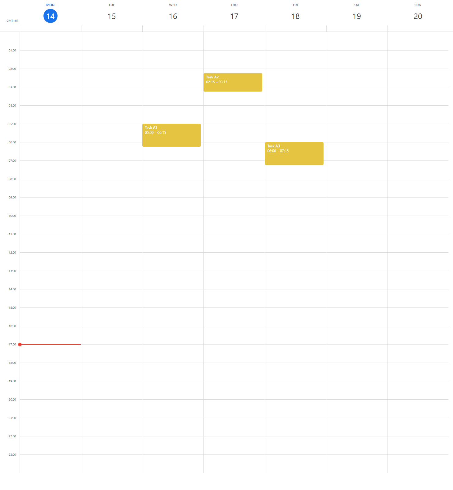

# Time Blocking Calendar

A Google-Calendar-style **7-day time-blocking calendar** built as a React component.
Create, move, inspect, edit and delete events directly on the grid.

**Live demo:** [https://softdreams-time-blocking.netlify.app/](https://softdreams-time-blocking.netlify.app/)



## Features

| Requirement | How it works |
| --- | --- |
| Events have title, description, start & end date-time (no all-day events) | `CalendarEvent` type; form uses `datetime-local` inputs |
| Shows 7 days starting from today | `getWeekDays(new Date())` — header highlights today, red line marks the current time |
| Drag on empty space → create dialog | `useDragToCreate`: press-and-drag selects a 15-min-snapped range and opens the form (a plain click selects one hour) |
| Drag & drop an event → new time | `useDragToMove`: drag to any slot on any of the 7 days; duration is preserved, start snaps to 15 min |
| Left-click an event → detail dialog | Click (pointer moved < 4 px) opens the read-only dialog |
| Right-click an event → context menu with **Edit** / **Delete** | Custom `ContextMenu`; Edit opens the form pre-filled, Delete removes the event |

Extras: overlapping events are laid out side by side, events persist in `localStorage`,
sample events are seeded on first load, dialogs trap focus and close on `Esc` / backdrop click.

## Tech stack

- **React 19 + TypeScript** — no runtime dependencies besides `react` / `react-dom`
- **Tailwind CSS v4** for styling
- **Vite** for dev/build, **Vitest + Testing Library** for tests (dev-only)

No date, drag-and-drop, UI or state-management libraries are used — date math, pointer-based
drag & drop, the modal and the context menu are all implemented by hand.

## Getting started

```bash
npm install
npm run dev        # http://localhost:5173
```

Other scripts:

```bash
npm run build      # type-check + production build → dist/
npm run preview    # serve the production build
npm run lint       # oxlint
npm test           # vitest (watch)
npm run test:run   # vitest single run
npm run test:coverage
```

## Project structure

```
src/
  components/
    calendar/    Calendar (state + wiring), CalendarHeader, CalendarGrid,
                 TimeGutter, HourLines, DayColumn, EventBlock, SelectionBlock, CurrentTimeLine
    dialogs/     EventFormDialog (create/edit), EventDetailDialog, FormField
    ui/          Modal, ContextMenu, Button — hand-written primitives
  hooks/         useEvents (reducer + localStorage), useDragToCreate, useDragToMove, useNow
  types/         CalendarEvent, EventDraft, TimeRange
  utils/         date helpers, layout math (positioning / overlap columns / pointer → slot),
                 validation, storage, seed data
```

Tests live next to the code they cover (`*.test.ts(x)`): unit tests for utils and hooks,
component tests for the dialogs/primitives, and an integration suite (`Calendar.test.tsx`)
that drives every requirement through pointer events.

## Deployment

The app is a static site. Build with `npm run build` and deploy the `dist/` folder to any
static host (Vercel, Netlify, GitHub Pages, …).
